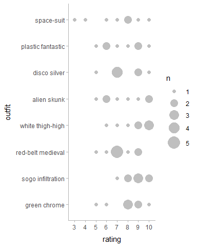
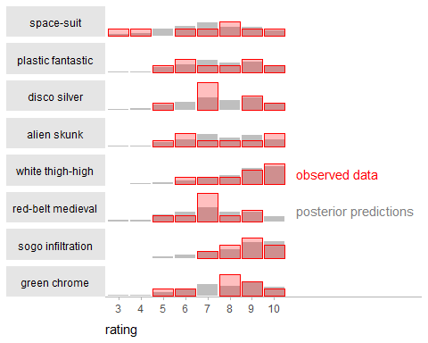
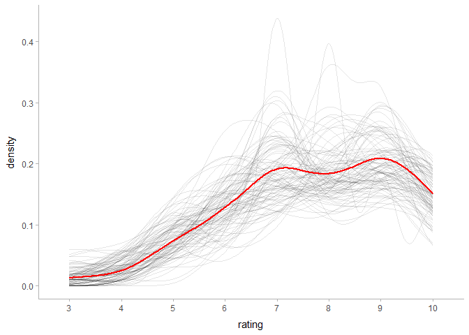

Racoon plots (and other ordinal examples) for Barbarella outfit data
================

## Setup

The following libraries are needed:

``` r
library(tidyverse)
library(modelr)
library(rstan)
library(brms)
library(tidybayes)
library(ggstance)
library(forcats)

theme_set(theme_tidybayes())

rstan_options(auto_write = TRUE)
options(mc.cores = parallel::detectCores())
```

## Data

We’re going to use this data:


Which is (approximately) this:

``` r
barb = rbind(
  data.frame(
    outfit = "space-suit",
    rating = c(3,4,6,7,8,8,9,10)
  ),
  data.frame(
    outfit = "plastic fantastic",
    rating = c(5,6,6,7,8,9,9,10)
  ),
  data.frame(
    outfit = "disco silver",
    rating = c(5,7,7,7,7,9,9,10)
  ),
  data.frame(
    outfit = "alien skunk",
    rating = c(5,6,6,7,8,9,10,10)
  ),
  data.frame(
    outfit = "white thigh-high",
    rating = c(6,7,8,9,9,10,10,10)
  ),
  data.frame(
    # I'm pretty sure I transcribed this one incorrectly...
    outfit = "red-belt medieval",
    rating = c(5,6,7,7,7,7,7,8,9,9)
  ),
  data.frame(
    outfit = "sogo infiltration",
    rating = c(7,8,8,9,9,9,10,10)
  ),
  data.frame(
    outfit = "green chrome",
    rating = c(5,6,8,8,8,9,9,10)
  )
) %>%
  mutate(
    # reversing order here makes the display order correct
    outfit = fct_rev(outfit),
    rating = ordered(rating)
  )
```

Which looks like this:

``` r
barb %>%
  ggplot(aes(x = rating, y = outfit)) +
  geom_count(color = "gray75")
```

<!-- -->

## Model

We’ll fit a simple ordinal regression.

**N.B.**: Do not use these results for important Barbarella-related
decision-making\! At the very least, there were presumably repeat raters
in this data which we would probably want to incorporate into the model,
not to mention coming up with reasonably Barbarella-informed priors in
order to make the best Barbarella-related decisions we could.

``` r
m = brm(rating ~ outfit, data = barb, family = cumulative, 
  prior = c(
    prior(normal(0, 2), class = b),
    prior(normal(0, 4), class = Intercept)
  ),
  control = list(adapt_delta = .99), seed = 12345
)
```

    ## Compiling the C++ model

    ## Start sampling

## Posterior predictive check

Here’s a sort of racoon plot:

``` r
barb %>%
  select(outfit) %>%
  add_predicted_draws(m, prediction = "rating", seed = 494930) %>%
  ggplot(aes(x = rating, y = outfit, group = NA)) +
  geom_count(aes(size = stat(prop)), color = "gray75") +
  geom_count(aes(size = stat(prop)), data = barb, color = "red", alpha = 0.25) +
  scale_size_continuous(range = c(1,10))
```

<!-- -->

I’m not sure how well this plot works in this case. It takes a bit more
work to investigate each row.

Perhaps this plot is more applicable when the predictor is continuous
(as in the case of mpg/cyl in the `mtcars` dataset) than here, where the
predictor is categorical (`outfit`). The plot is complicated here
because the observed data *and* the posterior prediction are encoding
information in the size of their respective dots, which was not the case
for the `mtcars` example in the `tidybayes` docs, which I think made it
much easier to read.

Anyway, here’s a more traditional posterior predictive check plot:

``` r
barb %>%
  select(outfit) %>%
  add_predicted_draws(m, prediction = "rating", n = 100, seed = 494930) %>%
  ggplot(aes(x = rating)) +
  stat_density(aes(group = .draw), geom = "line", position = "identity", alpha = .1) +
  stat_density(aes(group = NA), geom = "line", data = barb, color = "red", size = 1) 
```

<!-- -->

## Mean ratings

Finally, posterior distribution for the mean rating by outfit (along
with the sample mean in red):

``` r
barb %>%
  data_grid(outfit) %>%
  add_fitted_draws(m, value = "P(rating | outfit)") %>%
  mutate(rating = as.numeric(as.character(.category))) %>%
  group_by(outfit, .draw) %>%
  summarise(`mean rating` = sum(rating * `P(rating | outfit)`)) %>%
  ggplot(aes(x = `mean rating`, y = outfit)) +
  geom_halfeyeh() +
  stat_summaryh(aes(x = as.numeric(as.character(rating))), geom = "point", fun.x = mean, data = barb, color = "red")
```

<!-- -->
