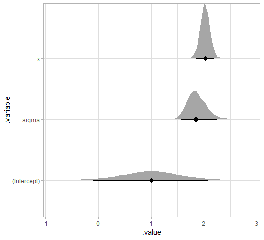
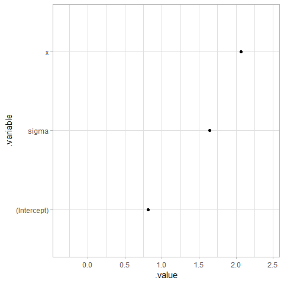
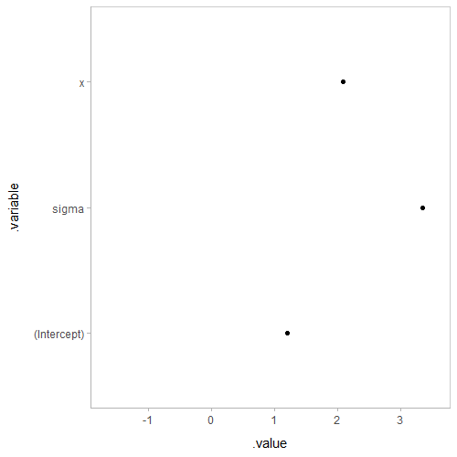
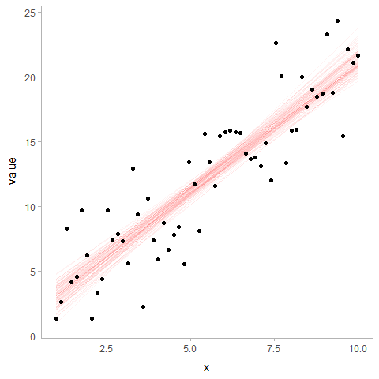
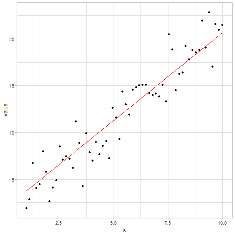
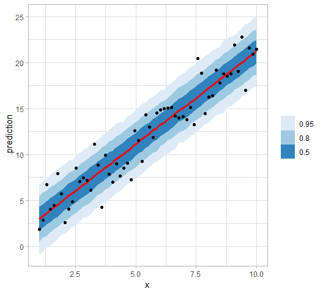

Linear regression
================

## Setup

Libraries that might be of help:

``` r
library(tidyverse)
library(magrittr)
library(ggplot2)
library(rstanarm)
library(modelr)
library(tidybayes)            # install from github
library(gganimate)            # install from github

theme_set(theme_light())
```

### Data

Let’s generate some vaguely linear data:

``` r
set.seed(123)
sample_size = 60
a = 1
b = 2
sigma = 2


df = data_frame(
  x = seq(1, 10, length.out = sample_size),
  y = rnorm(sample_size, a + b * x, sigma),
  group = rep(c("a", "b"), sample_size/2),
  x_centered = x - mean(x)
) 

df
```

    ## # A tibble: 60 x 4
    ##        x     y group x_centered
    ##    <dbl> <dbl> <chr>      <dbl>
    ##  1  1     1.88 a          -4.5 
    ##  2  1.15  2.84 b          -4.35
    ##  3  1.31  6.73 a          -4.19
    ##  4  1.46  4.06 b          -4.04
    ##  5  1.61  4.48 a          -3.89
    ##  6  1.76  7.96 b          -3.74
    ##  7  1.92  5.75 a          -3.58
    ##  8  2.07  2.61 b          -3.43
    ##  9  2.22  4.07 a          -3.28
    ## 10  2.37  4.85 b          -3.13
    ## # ... with 50 more rows

``` r
df %>%
  ggplot(aes(x = x, y = y)) +
  geom_point() 
```

<!-- -->

``` r
m = stan_glm(y ~ x, data = df)
```

    ## 
    ## SAMPLING FOR MODEL 'continuous' NOW (CHAIN 1).
    ## 
    ## Gradient evaluation took 0 seconds
    ## 1000 transitions using 10 leapfrog steps per transition would take 0 seconds.
    ## Adjust your expectations accordingly!
    ## 
    ## 
    ## Iteration:    1 / 2000 [  0%]  (Warmup)
    ## Iteration:  200 / 2000 [ 10%]  (Warmup)
    ## Iteration:  400 / 2000 [ 20%]  (Warmup)
    ## Iteration:  600 / 2000 [ 30%]  (Warmup)
    ## Iteration:  800 / 2000 [ 40%]  (Warmup)
    ## Iteration: 1000 / 2000 [ 50%]  (Warmup)
    ## Iteration: 1001 / 2000 [ 50%]  (Sampling)
    ## Iteration: 1200 / 2000 [ 60%]  (Sampling)
    ## Iteration: 1400 / 2000 [ 70%]  (Sampling)
    ## Iteration: 1600 / 2000 [ 80%]  (Sampling)
    ## Iteration: 1800 / 2000 [ 90%]  (Sampling)
    ## Iteration: 2000 / 2000 [100%]  (Sampling)
    ## 
    ##  Elapsed Time: 0.052 seconds (Warm-up)
    ##                0.046 seconds (Sampling)
    ##                0.098 seconds (Total)
    ## 
    ## 
    ## SAMPLING FOR MODEL 'continuous' NOW (CHAIN 2).
    ## 
    ## Gradient evaluation took 0 seconds
    ## 1000 transitions using 10 leapfrog steps per transition would take 0 seconds.
    ## Adjust your expectations accordingly!
    ## 
    ## 
    ## Iteration:    1 / 2000 [  0%]  (Warmup)
    ## Iteration:  200 / 2000 [ 10%]  (Warmup)
    ## Iteration:  400 / 2000 [ 20%]  (Warmup)
    ## Iteration:  600 / 2000 [ 30%]  (Warmup)
    ## Iteration:  800 / 2000 [ 40%]  (Warmup)
    ## Iteration: 1000 / 2000 [ 50%]  (Warmup)
    ## Iteration: 1001 / 2000 [ 50%]  (Sampling)
    ## Iteration: 1200 / 2000 [ 60%]  (Sampling)
    ## Iteration: 1400 / 2000 [ 70%]  (Sampling)
    ## Iteration: 1600 / 2000 [ 80%]  (Sampling)
    ## Iteration: 1800 / 2000 [ 90%]  (Sampling)
    ## Iteration: 2000 / 2000 [100%]  (Sampling)
    ## 
    ##  Elapsed Time: 0.049 seconds (Warm-up)
    ##                0.042 seconds (Sampling)
    ##                0.091 seconds (Total)
    ## 
    ## 
    ## SAMPLING FOR MODEL 'continuous' NOW (CHAIN 3).
    ## 
    ## Gradient evaluation took 0 seconds
    ## 1000 transitions using 10 leapfrog steps per transition would take 0 seconds.
    ## Adjust your expectations accordingly!
    ## 
    ## 
    ## Iteration:    1 / 2000 [  0%]  (Warmup)
    ## Iteration:  200 / 2000 [ 10%]  (Warmup)
    ## Iteration:  400 / 2000 [ 20%]  (Warmup)
    ## Iteration:  600 / 2000 [ 30%]  (Warmup)
    ## Iteration:  800 / 2000 [ 40%]  (Warmup)
    ## Iteration: 1000 / 2000 [ 50%]  (Warmup)
    ## Iteration: 1001 / 2000 [ 50%]  (Sampling)
    ## Iteration: 1200 / 2000 [ 60%]  (Sampling)
    ## Iteration: 1400 / 2000 [ 70%]  (Sampling)
    ## Iteration: 1600 / 2000 [ 80%]  (Sampling)
    ## Iteration: 1800 / 2000 [ 90%]  (Sampling)
    ## Iteration: 2000 / 2000 [100%]  (Sampling)
    ## 
    ##  Elapsed Time: 0.052 seconds (Warm-up)
    ##                0.044 seconds (Sampling)
    ##                0.096 seconds (Total)
    ## 
    ## 
    ## SAMPLING FOR MODEL 'continuous' NOW (CHAIN 4).
    ## 
    ## Gradient evaluation took 0 seconds
    ## 1000 transitions using 10 leapfrog steps per transition would take 0 seconds.
    ## Adjust your expectations accordingly!
    ## 
    ## 
    ## Iteration:    1 / 2000 [  0%]  (Warmup)
    ## Iteration:  200 / 2000 [ 10%]  (Warmup)
    ## Iteration:  400 / 2000 [ 20%]  (Warmup)
    ## Iteration:  600 / 2000 [ 30%]  (Warmup)
    ## Iteration:  800 / 2000 [ 40%]  (Warmup)
    ## Iteration: 1000 / 2000 [ 50%]  (Warmup)
    ## Iteration: 1001 / 2000 [ 50%]  (Sampling)
    ## Iteration: 1200 / 2000 [ 60%]  (Sampling)
    ## Iteration: 1400 / 2000 [ 70%]  (Sampling)
    ## Iteration: 1600 / 2000 [ 80%]  (Sampling)
    ## Iteration: 1800 / 2000 [ 90%]  (Sampling)
    ## Iteration: 2000 / 2000 [100%]  (Sampling)
    ## 
    ##  Elapsed Time: 0.066 seconds (Warm-up)
    ##                0.045 seconds (Sampling)
    ##                0.111 seconds (Total)

### Visualizations

#### “Half-eye” plot / interval + density

``` r
m %>%
  gather_draws(`(Intercept)`, x, sigma) %>%
  ggplot(aes(x = .value, y = .variable)) +
  geom_halfeyeh()
```

<!-- -->

#### Quantile dotplots

``` r
m %>%
  gather_draws(`(Intercept)`, x, sigma) %>%
  do(data.frame(.value = quantile(.$.value, ppoints(100)))) %>%
  ggplot(aes(x = .value)) +
  geom_dotplot(binwidth = 0.04) +
  facet_grid(.variable ~ .)
```

<!-- -->

#### HOPs of coefficients

``` r
m %>%
  gather_draws(`(Intercept)`, x, sigma) %>%
  filter(.draw %in% floor(seq_range(.draw, n = 100))) %>%
  ggplot(aes(x = .value, y = .variable)) +
  geom_point() +
  transition_manual(.draw)
```

<!-- -->

Controlling framerate:

``` r
p = m %>%
  gather_draws(`(Intercept)`, x, sigma) %>%
  filter(.draw %in% floor(seq_range(.draw, n = 100))) %>%
  ggplot(aes(x = .value, y = .variable)) +
  geom_point() +
  transition_manual(.draw)

animate(p, fps = 5)
```

<!-- -->

#### Fit lines with uncertainty bands

``` r
df %>%
  add_fitted_draws(m) %>%
  ggplot(aes(x = x, y = .value)) +
  stat_lineribbon(.width = c(.50, .80, .95), fill = "gray50", alpha = .25) +
  geom_point(aes(y = y), data = df)
```

<!-- -->

#### Overplotted regression lines

``` r
df %>%
  add_fitted_draws(m, n = 100) %>%
  ggplot(aes(x = x, y = .value)) +
  geom_line(aes(group = .draw), alpha = 0.1, color = "red") +
  geom_point(aes(y = y), data = df)
```

<!-- -->

#### Regression lines as animated HOPs

Basic example:

``` r
df %>%
  add_fitted_draws(m, n = 100) %>%
  ggplot(aes(x = x, y = .value)) +
  geom_line(color = "red") +
  geom_point(aes(y = y), data = df) +
  transition_manual(.draw)
```

<!-- -->

Showing how to control speed:

``` r
p = df %>%
  add_fitted_draws(m, n = 100) %>%
  ggplot(aes(x = x, y = .value)) +
  geom_line(color = "red") +
  geom_point(aes(y = y), data = df) +
  transition_manual(.draw)

animate(p, fps = 5)
```

<!-- -->

#### Posterior predictions with uncertainty bands

``` r
df %>%
  add_predicted_draws(m) %>%
  ggplot(aes(x = x, y = .prediction)) +
  stat_lineribbon() +
  scale_fill_brewer() +
  geom_point(aes(y = y), data = df)
```

<!-- -->
