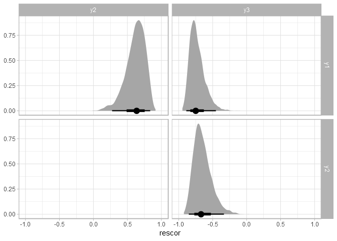
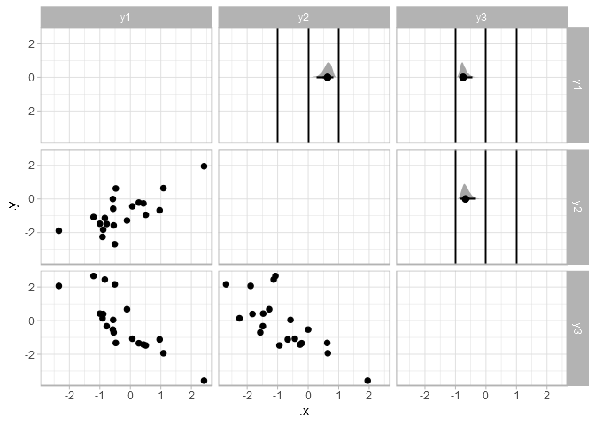

Multivariate regression
================

## Setup

Libraries that might be of help:

``` r
library(tidyverse)
library(magrittr)
library(ggplot2)
library(rstan)
library(brms)
library(modelr)
library(tidybayes)

theme_set(theme_light())
rstan_options(auto_write = TRUE)
options(mc.cores = parallel::detectCores())
```

### Data

``` r
set.seed(1234)

df =  data_frame(
  y1 = rnorm(20),
  y2 = rnorm(20, y1),
  y3 = rnorm(20, -y1)
)
```

### Data plot

``` r
df %>%
  gather(.variable, .value) %>%
  gather_pairs(.variable, .value) %>%
  ggplot(aes(.x, .y)) +
  geom_point() +
  facet_grid(.row ~ .col)
```

<!-- -->

### Model

``` r
m = brm(cbind(y1, y2, y3) ~ 1, data = df)
```

    ## Setting 'rescor' to TRUE by default for this model

    ## Compiling the C++ model

    ## Start sampling

### Correlations from the model

A plot of the `rescor` coefficients from the model:

``` r
m %>%
  gather_draws(`rescor.*`, regex = TRUE) %>%
  separate(.variable, c(".rescor", ".row", ".col"), sep = "__") %>%
  ggplot(aes(x = .value, y = 0)) +
  geom_halfeyeh() +
  xlim(c(-1, 1)) +
  xlab("rescor") +
  ylab(NULL) +
  facet_grid(.row ~ .col)
```

<!-- -->

### Altogether

I’m not sure I like this (we’re kind of streching the limits of
`facet_grid` here…) but if you absolutely must have a combined plot,
this sort of thing could work…

``` r
correlations = m %>%
  gather_draws(`rescor.*`, regex = TRUE) %>%
  separate(.variable, c(".rescor", ".row", ".col"), sep = "__")


df %>%
  gather(.variable, .value) %>%
  gather_pairs(.variable, .value) %>%
  ggplot(aes(.x, .y)) +
  
  # scatterplots
  geom_point() +

  # correlations
  geom_halfeyeh(aes(x = .value, y = 0), data = correlations) +
  geom_vline(aes(xintercept = x), data = correlations %>% data_grid(nesting(.row, .col), x = c(-1, 0, 1))) +

  facet_grid(.row ~ .col)
```

<!-- -->
