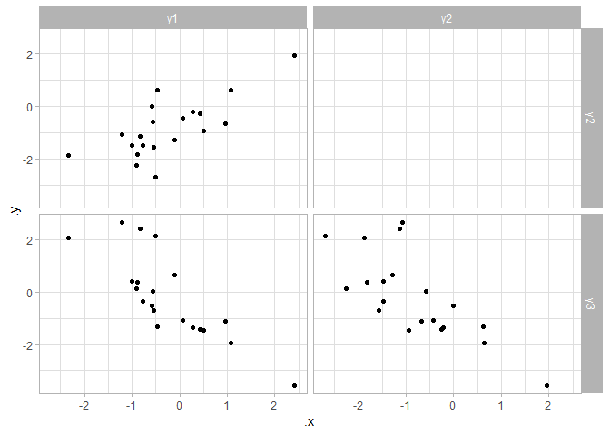
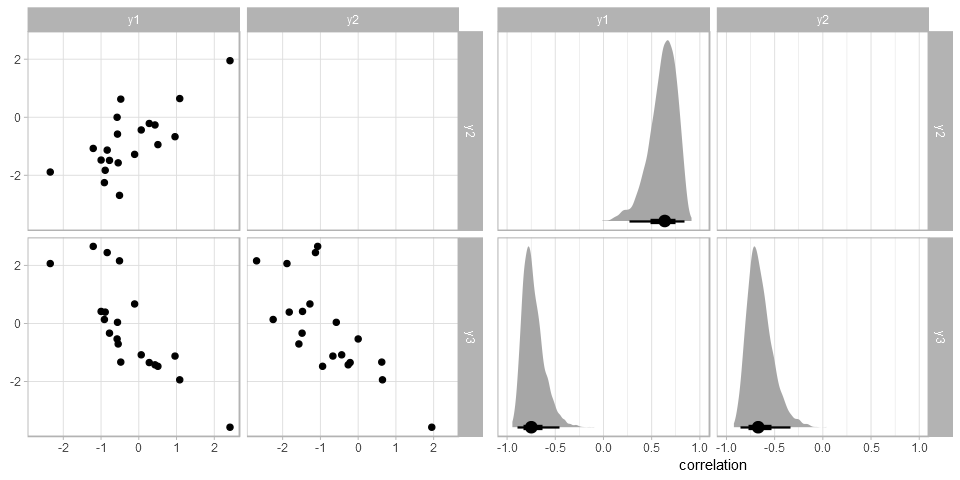
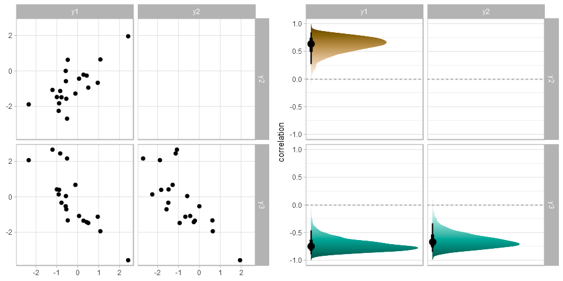
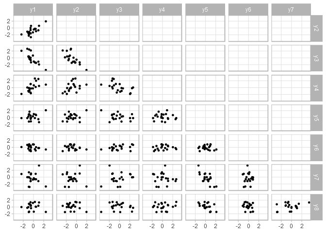
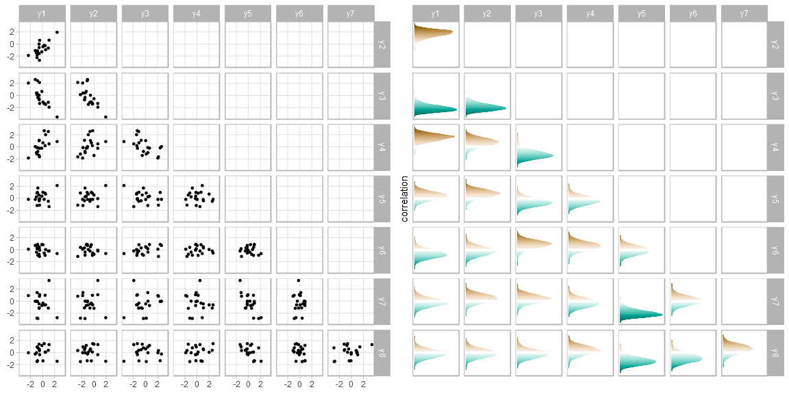
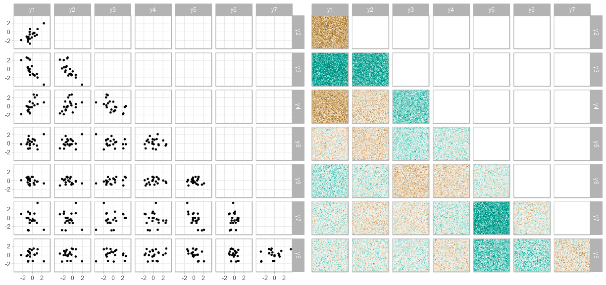

Multivariate regression
================

## Setup

Libraries that might be of help:

``` r
library(tidyverse)
library(magrittr)
library(ggplot2)
library(rstan)
library(brms)
library(modelr)
library(tidybayes)
library(ggridges)
library(patchwork)  # devtools::install_github("thomasp85/patchwork")

theme_set(theme_light())
rstan_options(auto_write = TRUE)
options(mc.cores = parallel::detectCores())
```

### Data

``` r
set.seed(1234)

df =  data_frame(
  y1 = rnorm(20),
  y2 = rnorm(20, y1),
  y3 = rnorm(20, -y1)
)
```

### Data plot

``` r
df %>%
  gather(.variable, .value) %>%
  gather_pairs(.variable, .value) %>%
  ggplot(aes(.x, .y)) +
  geom_point() +
  facet_grid(.row ~ .col)
```

<!-- -->

### Model

``` r
m = brm(cbind(y1, y2, y3) ~ 1, data = df)
```

    ## Setting 'rescor' to TRUE by default for this model

    ## Compiling the C++ model

    ## Start sampling

### Correlations from the model

A plot of the `rescor` coefficients from the model:

``` r
m %>%
  gather_draws(`rescor.*`, regex = TRUE) %>%
  separate(.variable, c(".rescor", ".row", ".col"), sep = "__") %>%
  ggplot(aes(x = .value, y = 0)) +
  geom_halfeyeh() +
  xlim(c(-1, 1)) +
  xlab("rescor") +
  ylab(NULL) +
  facet_grid(.row ~ .col)
```

<!-- -->

### Altogether

I’m not sure I like this (we’re kind of streching the limits of
`facet_grid` here…) but if you absolutely must have a combined plot,
this sort of thing could work…

``` r
correlations = m %>%
  gather_draws(`rescor.*`, regex = TRUE) %>%
  separate(.variable, c(".rescor", ".row", ".col"), sep = "__")


df %>%
  gather(.variable, .value) %>%
  gather_pairs(.variable, .value) %>%
  ggplot(aes(.x, .y)) +
  
  # scatterplots
  geom_point() +

  # correlations
  geom_halfeyeh(aes(x = .value, y = 0), data = correlations) +
  geom_vline(aes(xintercept = x), data = correlations %>% data_grid(nesting(.row, .col), x = c(-1, 0, 1))) +

  facet_grid(.row ~ .col)
```

<!-- -->

### Or side-by-side

Actually, it occurs to me that the traditional “flipped on the axis”
double-scatterplot-matrix can be hard to read, because it is hard to
mentally do the diagonal-mirroring operation to figure out which cell on
one side goes with the other. I find it easier to just map from the same
cell in one matrix onto another, which suggests something like this
might be better:

``` r
data_plot = df %>%
  gather(.variable, .value) %>%
  gather_pairs(.variable, .value) %>%
  ggplot(aes(.x, .y)) +
  geom_point(size = 1) +
  facet_grid(.row ~ .col)

rescor_plot = m %>%
  gather_draws(`rescor.*`, regex = TRUE) %>%
  separate(.variable, c(".rescor", ".col", ".row"), sep = "__") %>%
  ggplot(aes(x = .value, y = 0)) +
  geom_halfeyeh() +
  xlim(c(-1, 1)) +
  xlab("rescor") +
  ylab(NULL) +
  facet_grid(.row ~ .col)

data_plot + rescor_plot
```

<!-- -->

### More heatmap-y

Some other things possibly worth improving:

  - adding a color encoding back in for that high-level gist
  - making “up” be positive correlation and “down” be negative
  - 0 line

<!-- end list -->

``` r
rescor_plot_heat = m %>%
  gather_draws(`rescor.*`, regex = TRUE) %>%
  separate(.variable, c(".rescor", ".col", ".row"), sep = "__") %>%
  ggplot(aes(x = .value, y = 0)) +
  geom_density_ridges_gradient(aes(fill = stat(x)), color = NA) +
  geom_vline(xintercept = 0, color = "gray65", linetype = "dashed") +
  stat_pointintervalh() +
  xlim(c(-1, 1)) +
  xlab("residual correlation") +
  ylab(NULL) +
  scale_y_continuous(breaks = NULL) +
  scale_fill_distiller(type = "div", palette = "RdBu", direction = 1, limits = c(-1, 1), guide = FALSE) +
  coord_flip() +
  facet_grid(.row ~ .col)

data_plot + rescor_plot_heat
```

<!-- -->

## Okay, but does it scale?

Let’s add some more variables…

``` r
set.seed(1234)

df_large =  data_frame(
  y1 = rnorm(20),
  y2 = rnorm(20, y1),
  y3 = rnorm(20, -y1),
  y4 = rnorm(20, 0.5 * y1),
  y5 = rnorm(20),
  y6 = rnorm(20, -.25 * y1),
  y7 = rnorm(20, -y5),
  y8 = rnorm(20, -0.5 * y5)
)
```

``` r
data_plot_large = df_large %>%
  gather(.variable, .value) %>%
  gather_pairs(.variable, .value) %>%
  ggplot(aes(.x, .y)) +
  geom_point(size = 1) +
  facet_grid(.row ~ .col)

data_plot_large
```

<!-- -->

``` r
m_large = brm(cbind(y1, y2, y3, y4, y5, y6, y7, y8) ~ 1, data = df_large)
```

    ## Setting 'rescor' to TRUE by default for this model

    ## Compiling the C++ model

    ## Start sampling

### Density version

``` r
rescor_plot_heat_large = m_large %>%
  gather_draws(`rescor.*`, regex = TRUE) %>%
  separate(.variable, c(".rescor", ".col", ".row"), sep = "__") %>%
  ggplot(aes(x = .value, y = 0)) +
  geom_density_ridges_gradient(aes(fill = stat(x)), color = NA) +
  geom_vline(xintercept = 0, color = "gray85") +
  stat_pointintervalh() +
  xlim(c(-1, 1)) +
  xlab("residual correlation") +
  ylab(NULL) +
  scale_y_continuous(breaks = NULL) +
  scale_x_continuous(breaks = NULL) +
  scale_fill_distiller(type = "div", palette = "RdBu", direction = 1, limits = c(-1, 1), guide = FALSE) +
  coord_flip() +
  facet_grid(.row ~ .col)

data_plot_large + rescor_plot_heat_large
```

<!-- -->

You can still pick out the high/low correlations by color, though it
isn’t quite as easy.

### Dither approach

A different, more frequency-framing approach, would be to use dithering
to show uncertainty (see e.g. Figure 4 from [this
paper](http://doi.wiley.com/10.1002/sta4.150)). This is akin to
something like an icon array. You should still be able to see the
average color (thanks to the human visual system’s ensembling
processing), but also get a sense of the uncertainty by how “dithered” a
square looks:

``` r
w = 40
h = 40

rescor_plot_heat_dither = m_large %>%
  gather_draws(`rescor.*`, regex = TRUE) %>%
  separate(.variable, c(".rescor", ".col", ".row"), sep = "__") %>%
  group_by(.row, .col) %>%
  summarise(
    .value = list(sample(.value, w * h)),
    x = list(rep(1:w, times = h)),
    y = list(rep(1:h, each = w))
  ) %>%
  unnest() %>%
  ggplot(aes(x, y, fill = .value)) +
  geom_raster() +
  facet_grid(.row ~ .col) +
  scale_fill_distiller(type = "div", palette = "RdBu", direction = 1, limits = c(-1, 1), name = "residual\ncorrelation") +
  scale_y_continuous(breaks = NULL) +
  scale_x_continuous(breaks = NULL) +
  xlab(NULL) +
  ylab(NULL) +
  coord_cartesian(expand = FALSE)

data_plot_large + rescor_plot_heat_dither
```

<!-- -->
