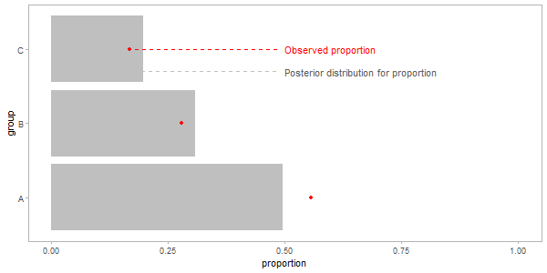
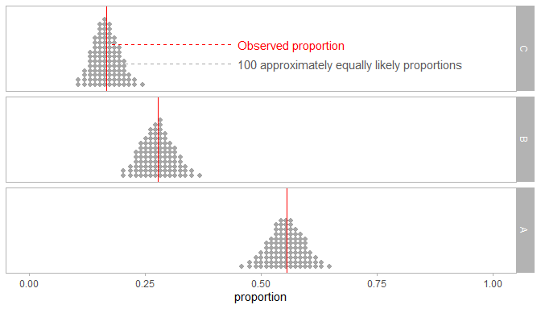
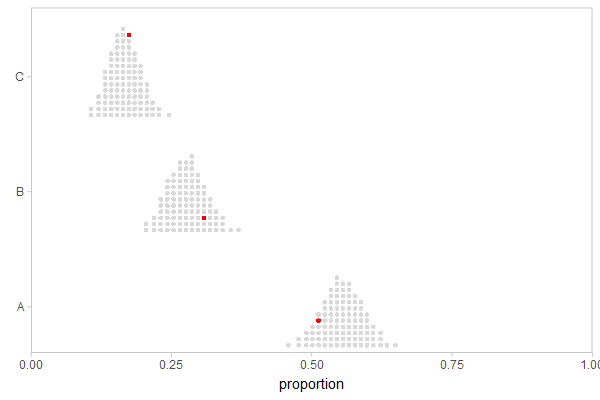

Hypothetical outcome plots (HOPs) and quantile dotplots for proportions
================

Here is a quick example of two frequency-framing approaches to
visualizing the uncertainty in a proportion: hypothetical outcome plots
(HOPs), which are useful when you are using a medium that supports
animation, and quantile dotplots, which are useful when you are using a
medium that does not support animation.

## Setup

The following libraries are needed:

``` r
library(tidyverse)
library(modelr)
library(rstanarm)
library(tidybayes)
library(gganimate)     # devtools::install_github("thomasp85/gganimate")
library(ggstance)
library(forcats)

theme_set(
  theme_light() +
  theme(panel.grid = element_blank())
)
```

## Data

We’ll use some count data to illustrate:

``` r
df = data_frame(
  group = c("A","B","C"),
  count = c(100, 50, 30),
  proportion = count / sum(count)
)
```

    ## Warning: `data_frame()` is deprecated, use `tibble()`.
    ## This warning is displayed once per session.

``` r
df
```

    ## # A tibble: 3 x 3
    ##   group count proportion
    ##   <chr> <dbl>      <dbl>
    ## 1 A       100      0.556
    ## 2 B        50      0.278
    ## 3 C        30      0.167

## Model

One *possible* model for this data is as follows (N.B. this makes some
strong assumptions about how the data were generated for the purposes of
an example, your mileage may vary\!):

``` r
m = stan_glm(count ~ group, family = poisson, data = df)
```

## Hypothetical outcome plots (HOPs)

Given that model, we could construct a HOPs (Hullman, Resnick, and Adar
[2015](#ref-Hullman2015); Kale et al. [2019](#ref-Kale2018)) bar chart
illustrating the posterior distribution for the proportion in each
group:

``` r
n_hops = 100

p = df %>%
  data_grid(group) %>%
  add_fitted_draws(m, n = n_hops) %>%
  group_by(.draw) %>%
  mutate(proportion = .value / sum(.value)) %>%
  ggplot(aes(y = group, x = proportion)) +
  geom_colh(fill = "gray75") +
  geom_point(data = df, color = "red") +
  annotate("text", y = "C", x = .5, label = "Observed proportion", hjust = 0, color = "red") +
  annotate("segment", y = "C", yend = "C", x = .18, xend = .49, linetype = "dashed", color = "red") +
  annotate("text", y = 2.7, x = .5, label = "Posterior distribution for proportion", hjust = 0,
    color = "gray35") +
  annotate("segment", y = 2.7, yend = 2.7, x = .1, xend = .49, linetype = "dashed", color = "gray75") +
  xlim(0,1) +
  transition_states(.draw, transition_length = 1, state_length = 1)

animate(p, nframes = n_hops * 2, width = 600, height = 300)
```

    ## Warning in file.create(to[okay]): cannot create file 'proportions_files/
    ## figure-gfm/hops-1.gif', reason 'No such file or directory'

<!-- -->

## Quantile dotplots

If animation were not available (e.g. in a print medium), an alternative
might be a quantile dotplot (Kay et al. [2016](#ref-Kay2016); Fernandes
et al. [2018](#ref-Fernandes2018)):

``` r
observed_label_data = data_frame(
  group = "C",
  label = "Observed proportion",
  x = .18, xend = .44, y = .55
)
dotplot_label_data = data_frame(
  group = "C",
  label = "100 approximately equally likely proportions",
  x = .18, xend = .44, y = .3
)


df %>%
  data_grid(group) %>%
  add_fitted_draws(m) %>%
  group_by(.draw) %>%
  mutate(proportion = .value / sum(.value)) %>%
  group_by(group) %>%
  do(data_frame(proportion = quantile(.$proportion, ppoints(100)))) %>%
  ggplot(aes(x = proportion)) +
  geom_dotplot(binwidth = .01, fill = "gray65", color = NA) +
  facet_grid(fct_rev(group) ~ .) +
  geom_text(aes(xend + .01, y, label = label), data = observed_label_data, hjust = 0, color = "red") +
  geom_segment(aes(x, y, xend = xend, yend = y), data = observed_label_data,
    linetype = "dashed", color = "red") +
  geom_vline(aes(xintercept = proportion), data = df, color = "red") +
  geom_text(aes(xend + .01, y, label = label), data = dotplot_label_data, hjust = 0, color = "gray35") +
  geom_segment(aes(x, y, xend = xend, yend = y), data = dotplot_label_data,
    linetype = "dashed", color = "gray65") +
  xlim(0,1) +
  ylab(NULL) +
  scale_y_continuous(breaks = NULL)
```

<!-- -->

## Blinky dotplots

One could also try combining HOPs and dotplots by drawing a quantile
dotplot and then highlighting the closest quantile in each row to some
draw from the posterior in each frame of a HOP. **Note** this is
experimental (both the code and the technique itself are untested; **the
code requires the latest development version of tidybayes from
github**).

``` r
n_hops = 100

proportions = df %>%
  data_grid(group) %>%
  add_fitted_draws(m) %>%
  group_by(.draw) %>%
  mutate(proportion = .value / sum(.value)) 

quantiles = proportions %>%
  group_by(group) %>%
  summarise(proportion_quantile = list(quantile(proportion, ppoints(n_hops)))) 

p = proportions %>%
  sample_draws(n_hops) %>%
  inner_join(quantiles, by = "group") %>%
  unnest(proportion_quantile) %>%
  group_by(group, .draw) %>%
  mutate(
    highlight = seq_along(proportion_quantile) == which.min(abs(proportion - proportion_quantile))
  ) %>%
  # ungroup() %>%
  # filter(.draw == min(.draw)) %>%
  ggplot(aes(y = group, x = proportion_quantile)) +
  geom_dotsh(aes(fill = highlight, group = .draw), shape = 21, justification = 0.4, color = NA) +
  guides(fill = FALSE) +
  scale_fill_manual(values = c("gray85", "red")) +
  transition_manual(.draw) +
  xlim(0,1) +
  ylab(NULL) +
  xlab("proportion") +
  coord_cartesian(expand = FALSE)
  
animate(p, nframes = n_hops * 2, fps = 2.5, type = "cairo", width = 600, height = 400, res = 100)
```

    ## nframes and fps adjusted to match transition

<!-- -->

## References

<div id="refs" class="references">

<div id="ref-Fernandes2018">

Fernandes, Michael, Logan Walls, Sean Munson, Jessica Hullman, and
Matthew Kay. 2018. “Uncertainty Displays Using Quantile Dotplots or CDFs
Improve Transit Decision-Making.” *Conference on Human Factors in
Computing Systems - CHI ’18*. <https://doi.org/10.1145/3173574.3173718>.

</div>

<div id="ref-Hullman2015">

Hullman, Jessica, Paul Resnick, and Eytan Adar. 2015. “Hypothetical
Outcome Plots Outperform Error Bars and Violin Plots for Inferences
about Reliability of Variable Ordering.” *PloS One* 10 (11).
<https://doi.org/10.1371/journal.pone.0142444>.

</div>

<div id="ref-Kale2018">

Kale, Alex, Francis Nguyen, Matthew Kay, and Jessica Hullman. 2019.
“Hypothetical Outcome Plots Help Untrained Observers Judge Trends in
Ambiguous Data.” *Transactions on Visualization and Computer Graphics*.

</div>

<div id="ref-Kay2016">

Kay, Matthew, Tara Kola, Jessica R Hullman, and Sean A Munson. 2016.
“When (ish) is My Bus? User-centered Visualizations of Uncertainty in
Everyday, Mobile Predictive Systems.” *Proceedings of the 2016 CHI
Conference on Human Factors in Computing Systems - CHI ’16*, 5092–5103.
<https://doi.org/10.1145/2858036.2858558>.

</div>

</div>
