Uncertainty examples with US unemployment data
================

  - [Introduction](#introduction)
  - [Setup](#setup)
  - [Data](#data)
  - [Model](#model)
  - [Spaghetti plot](#spaghetti-plot)
  - [Uncertainty bands](#uncertainty-bands)
  - [Gradient plot](#gradient-plot)
  - [Density plot](#density-plot)
      - [CDF](#cdf)
  - [Last point predictions](#last-point-predictions)
  - [Continuous encodings (for single
    prediction)](#continuous-encodings-for-single-prediction)
  - [Quantile dotplot](#quantile-dotplot)
  - [HOPs](#hops)

## Introduction

This example shows some examples of uncertainty visualization with US
unemployment data

## Setup

``` r
library(tidyverse)
library(ggplot2)
library(rstan)
library(modelr)
library(tidybayes)
library(brms)
library(bsts)
library(gganimate)
library(cowplot)
library(lubridate)
library(ggridges)
library(colorspace)

theme_set(
  theme_tidybayes()
)

rstan_options(auto_write = TRUE)
options(mc.cores = 1)#parallel::detectCores())

knitr::opts_chunk$set(
  fig.width = 9,
  fig.height = 4.5,
  dev.args = list(png = list(type = "cairo"))
)
```

## Data

We’ll use this data on US unemployment rates:

``` r
df = read_csv("us-unemployment.csv", col_types = cols(
    date = col_date(), 
    unemployment = col_double()
  )) %>%
  mutate(
    unemployment = unemployment / 100,
    logit_unemployment = qlogis(unemployment),
    m = month(date),
    time = 1:n()
  )
```

Which looks like this:

``` r
y_max = .11
y_axis = list(
  coord_cartesian(ylim = c(0, y_max), expand = FALSE),
  scale_y_continuous(labels = scales::percent),
  theme(axis.text.y = element_text(vjust = 0.05))
)
title = labs(x = NULL, y = NULL, subtitle = "US unemployment over time")

df %>%
  ggplot(aes(x = date, y = unemployment)) +
  geom_line() +
  y_axis +
  title 
```

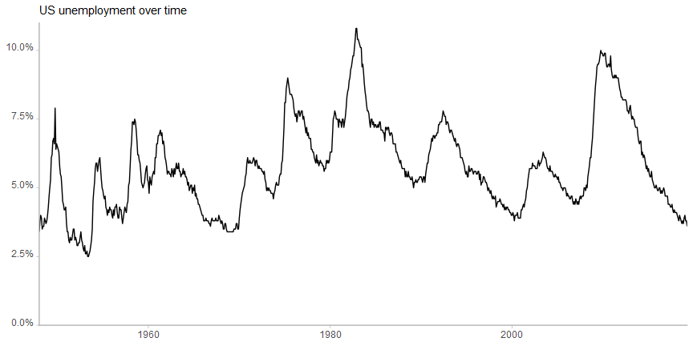<!-- -->

## Model

We’ll fit a relatively simple time series model using `bsts` (Bayesian
Structural Time Series). I wouldn’t use this model for anything
important—there isn’t really any domain knowledge going into this, I’m
not a time series expert nor am I an expert in unemployment.

``` r
set.seed(123456)
m = with(df, bsts(logit_unemployment, state.specification = list() %>%
    AddSemilocalLinearTrend(logit_unemployment) %>%
    AddSeasonal(logit_unemployment, 12),
  niter = 10000))
```

    ## =-=-=-=-= Iteration 0 Tue Jun 04 16:37:35 2019
    ##  =-=-=-=-=
    ## =-=-=-=-= Iteration 1000 Tue Jun 04 16:37:49 2019
    ##  =-=-=-=-=
    ## =-=-=-=-= Iteration 2000 Tue Jun 04 16:38:03 2019
    ##  =-=-=-=-=
    ## =-=-=-=-= Iteration 3000 Tue Jun 04 16:38:17 2019
    ##  =-=-=-=-=
    ## =-=-=-=-= Iteration 4000 Tue Jun 04 16:38:30 2019
    ##  =-=-=-=-=
    ## =-=-=-=-= Iteration 5000 Tue Jun 04 16:38:42 2019
    ##  =-=-=-=-=
    ## =-=-=-=-= Iteration 6000 Tue Jun 04 16:38:55 2019
    ##  =-=-=-=-=
    ## =-=-=-=-= Iteration 7000 Tue Jun 04 16:39:08 2019
    ##  =-=-=-=-=
    ## =-=-=-=-= Iteration 8000 Tue Jun 04 16:39:22 2019
    ##  =-=-=-=-=
    ## =-=-=-=-= Iteration 9000 Tue Jun 04 16:39:35 2019
    ##  =-=-=-=-=

## Spaghetti plot

We’ll start by pulling out the fits for the existing data and some
predictions for the next year:

``` r
forecast_months = 13   # number of months forward to forecast
set.seed(123456)

fits = df %>%
  add_draws(plogis(colSums(aperm(m$state.contributions, c(2, 1, 3)))))

predictions = df %$%
  tibble(
    date = max(date) + months(1:forecast_months),
    m = month(date),
    time = max(time) + 1:forecast_months
  ) %>%
  add_draws(plogis(predict(m, horizon = forecast_months)$distribution), value = ".prediction")

predictions_with_last_obs = df %>% 
  slice(n()) %>% 
  mutate(.draw = list(1:max(predictions$.draw))) %>% 
  unnest() %>% 
  mutate(.prediction = unemployment) %>% 
  bind_rows(predictions)
```

Then make a spaghetti plot:

``` r
df %>%
  ggplot(aes(x = date, y = unemployment)) +
  geom_line(aes(y = .value, group = .draw), alpha = 1/20, data = fits %>% sample_draws(100)) +
  geom_line(aes(y = .prediction, group = .draw), alpha = 1/20, data = predictions %>% sample_draws(100)) +
  geom_point() +
  y_axis +
  title
```

<!-- -->

This is pretty hard to see, so let’s just look at the data since 2008:

``` r
since_year = 2008
set.seed(123456)
fit_color = "#3573b9"
fit_color_fill = hex(mixcolor(.6, sRGB(1,1,1), hex2RGB(fit_color)))
prediction_color = "#e41a1c"
prediction_color_fill = hex(mixcolor(.6, sRGB(1,1,1), hex2RGB(prediction_color)))

x_axis = list(
  scale_x_date(date_breaks = "1 years", labels = year),
  theme(axis.text.x = element_text(hjust = 0.1))
)
arrow_spec = arrow(length = unit(6, "points"), type = "closed")
fit_annotation = list(
  annotate("text", x = ymd("2014-04-08"), y = .09, hjust = 0, vjust = 0, lineheight = 1.1,
    label = 'Uncertainty in what\nunemployment'),
  annotate("text", x = ymd("2014-04-08"), y = .09, hjust = 0, vjust = 0, lineheight = 1.1,
    label = '\n                         was', color = fit_color, fontface = "bold"),
  annotate("segment", x = ymd("2015-03-01"), xend = ymd("2015-03-01"), y = .087, yend = .06, linejoin = "mitre",
    color = fit_color, size = 1, arrow = arrow_spec)
)
prediction_annotation = list(
  annotate("text", x = ymd("2018-02-16"), y = .09, hjust = 0, vjust = 0, lineheight = 1.1,
    label = 'Uncertainty in what \nunemployment'),
  annotate("text", x = ymd("2018-02-16"), y = .09, hjust = 0, vjust = 0, lineheight = 1.1,
    label = '\n                         will be', color = prediction_color, fontface = "bold"),
  annotate("segment", x = ymd("2019-05-01"), xend = ymd("2019-05-01"), y = .087, yend = .053, linejoin = "mitre",
    color = prediction_color, size = 1, arrow = arrow_spec)
)

df %>%
  filter(year(date) >= since_year) %>%
  ggplot(aes(x = date, y = unemployment)) +
  geom_line(aes(y = .value, group = .draw), alpha = 1/30, color = fit_color, size = .75,
    data = fits %>% filter(year(date) >= since_year) %>% sample_draws(100)) +
  geom_line(aes(y = .prediction, group = .draw), alpha = 1/20, color = prediction_color, size = .75,
    data = predictions %>% sample_draws(100)) +
  geom_point(size = 0.75) +
  fit_annotation +
  prediction_annotation +
  y_axis +
  x_axis +
  title
```

<!-- -->

## Uncertainty bands

We could instead use a predictive band:

``` r
df %>%
  filter(year(date) >= since_year) %>%
  ggplot(aes(x = date, y = unemployment)) +
  stat_lineribbon(aes(y = .value), fill = adjustcolor(fit_color, alpha.f = .25), color = fit_color, .width = .95,
    data = fits %>% filter(year(date) >= since_year)) +
  stat_lineribbon(aes(y = .prediction), fill = adjustcolor(prediction_color, alpha.f = .25), color = prediction_color, .width = .95,
    data = predictions) +
  geom_point(size = 0.75) +
  fit_annotation +
  prediction_annotation +
  y_axis +
  x_axis +
  title
```

<!-- -->

But that loses a lot of nuance and fixes the reader to whatever
arbitrary interval the visualization designer chose to display. One
alternative would be to show many intervals:

``` r
p = df %>%
  filter(year(date) >= since_year) %>%
  ggplot(aes(x = date, y = unemployment)) +
  stat_lineribbon(aes(y = .value), fill = fit_color, color = fit_color, alpha = 1/5, data = fits %>% filter(year(date) >= since_year)) +
  stat_lineribbon(aes(y = .prediction), fill = prediction_color, color = prediction_color, alpha = 1/5, data = predictions) +
  geom_point(size = 0.75) +
  fit_annotation +
  prediction_annotation +
  y_axis +
  x_axis +
  title

p
```

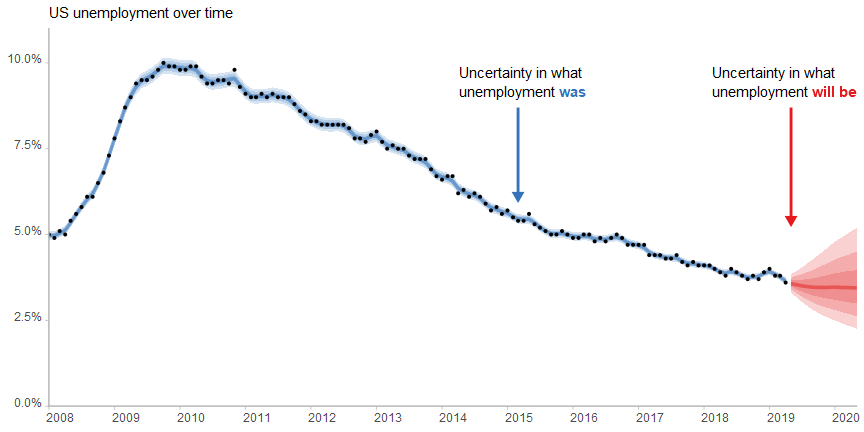<!-- -->

## Gradient plot

Or use a large number of bands, getting us essentially a gradient plot:

``` r
n_bands = 40

df %>%
  filter(year(date) >= since_year) %>%
  ggplot(aes(x = date, y = unemployment)) +
  stat_lineribbon(aes(y = .value), fill = fit_color, alpha = 1/n_bands, .width = ppoints(n_bands), 
    data = fits %>% filter(year(date) >= since_year), color = NA) +
  stat_lineribbon(aes(y = .prediction), fill = prediction_color, alpha = 1/n_bands, .width = ppoints(n_bands),
    data = predictions, color = NA) +
  geom_point(size = 0.75) +
  fit_annotation +
  prediction_annotation +
  y_axis +
  x_axis +
  title
```

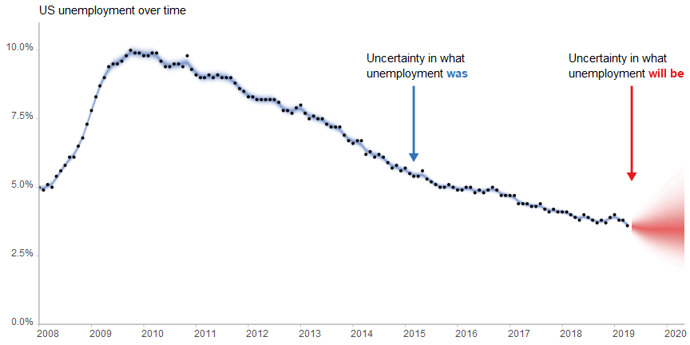<!-- -->

## Density plot

``` r
fit_plot = df %>%
  filter(year(date) >= since_year) %>%
  ggplot(aes(x = date, y = unemployment)) +
  geom_line(color = "gray75") +
  geom_point(size = 0.75) +
  y_axis +
  x_axis +
  expand_limits(x = ymd("2019-06-01")) +
  title

facet_x_labels = list(
  geom_vline(xintercept = 0, color = "gray75"),
  theme(
    strip.text.x = element_text(hjust = 0, size = 7.5, margin = margin(3, 1, 5, 1)),
    panel.spacing.x = unit(3, "points"),
    axis.text.y = element_text(vjust = 0.05),
    strip.background = element_blank(),
    plot.margin = margin(0, 3, 0, 0)
  )
)

predict_plot_equalarea = predictions %>%
  filter(date %in% c(ymd("2019-05-01"), ymd("2019-11-01"), ymd("2020-05-01"))) %>%
  ggplot(aes(x = .prediction)) +
  geom_hline(yintercept = 0, color = "gray85", linetype = "dashed") +
  stat_density(fill = prediction_color_fill, adjust = 2) +
  ylab(NULL) +
  xlab(NULL) +
  scale_y_continuous(breaks = NULL) +
  scale_x_continuous(breaks = NULL) +
  coord_flip(xlim = c(0, y_max), expand = FALSE) +
  facet_grid(. ~ date, labeller = labeller(date = function(x) strftime(x, "%b\n%Y")), switch = "x") +
  facet_x_labels

plot_grid(align = "h", axis = "tb", ncol = 2, rel_widths = c(5, 1),
  fit_plot,
  predict_plot_equalarea
  )
```

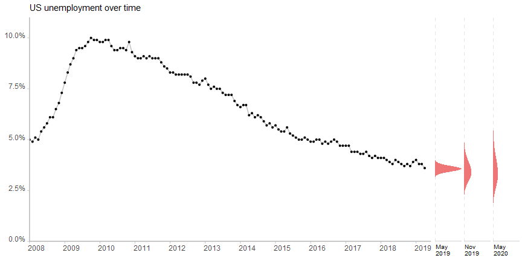<!-- -->

Can’t decide if I prefer the density normalized within predicted month
or not:

``` r
predict_plot = predict_plot_equalarea +
  facet_grid(. ~ date, labeller = labeller(date = function(x) strftime(x, "%b\n%Y")), switch = "x", scale = "free_x")

plot_grid(align = "h", axis = "tb", ncol = 2, rel_widths = c(5, 1),
  fit_plot,
  predict_plot
  )
```

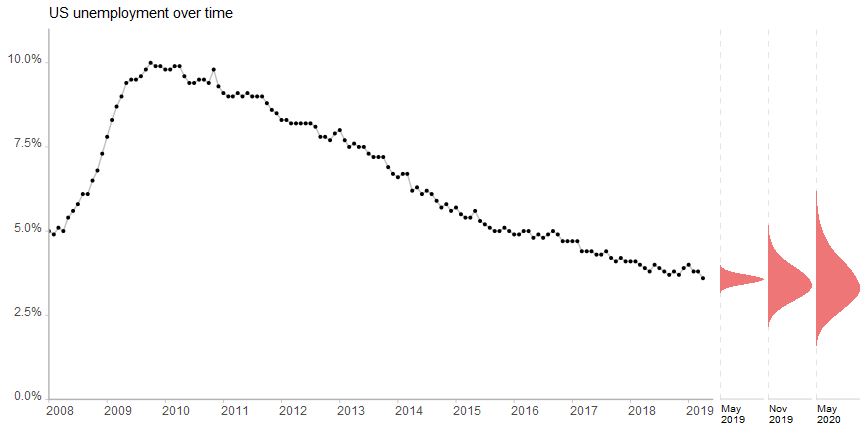<!-- -->

Another alternative would be to show an estimate / prediction every 6
months as a density plot:

``` r
fit_density_plot = fits %>%
  filter(date %in% (ymd("2007-11-01") + months(seq(0, 22*6, by = 6)))) %>%
  ggplot(aes(x = .value)) +
  geom_hline(yintercept = 0, color = "gray85", linetype = "dashed") +
  stat_density(fill = fit_color, adjust = 2, alpha = 3/5) +
  ylab(NULL) +
  xlab(NULL) +
  scale_y_continuous(breaks = NULL) +
  scale_x_continuous(labels = scales::percent) +
  coord_flip(xlim = c(0, y_max), expand = FALSE) +
  facet_grid(. ~ date, labeller = labeller(date = function(x) strftime(x, "%b\n%Y")), switch = "x", scale = "free_x") +
  facet_x_labels

plot_grid(align = "h", axis = "tb", ncol = 2, rel_widths = c(7.25, 1),
  fit_density_plot + title,
  predict_plot
  )
```

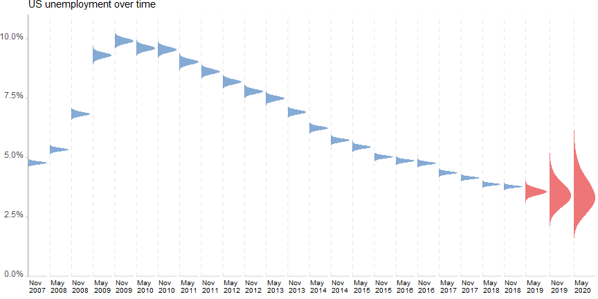<!-- -->

Here’s basically the same thing, but using `geom_density_ridges`:

``` r
fits %>%
  filter(date %in% (ymd("2007-11-01") + months(seq(0, 22*6, by = 6)))) %>%
  mutate(type = "fit") %>%
  bind_rows(
    predictions %>%
      filter(date %in% c(ymd("2019-05-01"), ymd("2019-11-01"), ymd("2020-05-01"))) %>%
      mutate(.value = .prediction, type = "prediction")
  ) %>%
  ggplot(aes(y = ordered(date), x = .value, fill = type)) +
  geom_density_ridges(aes(height = stat(ndensity)), size = NA, bandwidth = 0.0004, scale = .95) +
  scale_y_discrete(labels = function(x) strftime(x, "%b\n%Y")) +
  scale_fill_manual(values = c(fit_color_fill, prediction_color_fill), guide = FALSE) +
  coord_flip(xlim = c(0, y_max), expand = FALSE) +
  theme(axis.text.x = element_text(hjust = 0))
```

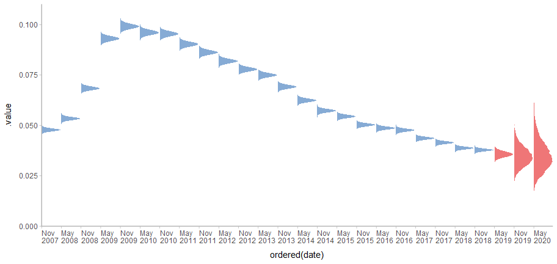<!-- -->

### CDF

``` r
predict_ccdf_plot = predictions %>%
  filter(date %in% c(ymd("2019-05-01"), ymd("2019-11-01"), ymd("2020-05-01"))) %>%
  ggplot(aes(x = .prediction)) +
  stat_ecdf(aes(y = 1 - stat(y)), geom = "area", fill = prediction_color_fill) +
  ylab(NULL) +
  xlab(NULL) +
  scale_y_reverse(breaks = NULL) +
  scale_x_continuous(breaks = NULL) +
  coord_flip(xlim = c(0, y_max), expand = FALSE) +
  facet_grid(. ~ date, labeller = labeller(date = function(x) strftime(x, "%b\n%Y")), switch = "x") +
  facet_x_labels

fit_ccdf_plot = fits %>%
  filter(date %in% (ymd("2007-11-01") + months(seq(0, 22*6, by = 6)))) %>%
  ggplot(aes(x = .value)) +
  stat_ecdf(aes(y = 1 - stat(y)), geom = "area", fill = fit_color, alpha = 3/5) +
  ylab(NULL) +
  xlab(NULL) +
  scale_y_reverse(breaks = NULL) +
  scale_x_continuous(labels = scales::percent) +
  coord_flip(xlim = c(0, y_max), expand = FALSE) +
  facet_grid(. ~ date, labeller = labeller(date = function(x) strftime(x, "%b\n%Y")), switch = "x", scale = "free_x") +
  facet_x_labels

plot_grid(align = "h", axis = "tb", ncol = 2, rel_widths = c(7.85, 1),
  fit_ccdf_plot + title,
  predict_ccdf_plot
  )
```

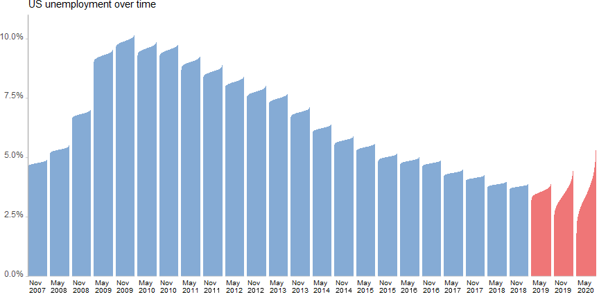<!-- -->

## Last point predictions

``` r
fit_plot +
  geom_point(data = . %>% slice(n()), size = 1.75) +
  geom_text(aes(label = paste0("  ", unemployment * 100, "%")), data = . %>% slice(n()), 
    hjust = 0, vjust = .4, size = 3.5, fontface = "bold") +
  expand_limits(x = ymd("2019-11-01"))
```

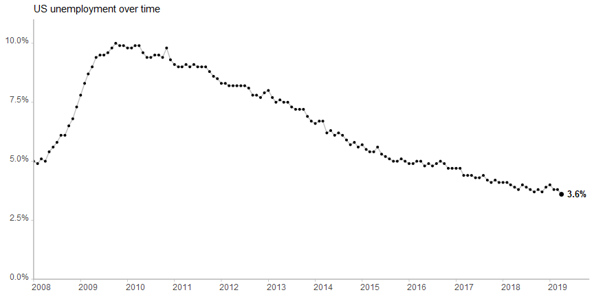<!-- -->

``` r
last_fit = fits %>% 
  ungroup() %>% 
  filter(date == max(date))

last_fit_plot = last_fit %>%
  ggplot(aes(x = .value)) +
  geom_hline(yintercept = 0, color = "gray85", linetype = "dashed") +
  stat_density(fill = fit_color, adjust = 2, alpha = 3/5) +
  ylab(NULL) +
  xlab(NULL) +
  scale_y_continuous(breaks = NULL) +
  scale_x_continuous(breaks = NULL) +
  coord_flip(xlim = c(0, y_max), expand = FALSE) +
  facet_grid(. ~ date, labeller = labeller(date = function(x) strftime(x, "%b\n%Y")), switch = "x", scale = "free_x") +
  facet_x_labels

plot_grid(align = "h", axis = "tb", ncol = 2, rel_widths = c(7.25, .5),
  fit_plot,
  last_fit_plot
  )
```

<!-- -->

``` r
last_fit %>% 
  ggplot(aes(x = .value)) +
  geom_vline(xintercept = 0, color = "gray75") +
  stat_density_ridges(aes(y = 0, fill = stat(quantile)), geom = "density_ridges_gradient", calc_ecdf = TRUE, quantiles = c(.025, .975), bandwidth = 0.0002, color = NA) +
  stat_density_ridges(aes(y = 0), geom = "density_ridges_gradient", bandwidth = 0.0002, color = "black", fill = NA) +
  scale_fill_brewer(guide = FALSE) +
  
  ylab(NULL) +
  xlab(NULL) +
  labs(subtitle = paste0("Uncertainty in what US unemployment was in ", strftime(last_fit$date[[1]], "%b %Y"))) +
  scale_y_continuous(breaks = NULL) +
  scale_x_continuous(labels = scales::percent_format(accuracy = .1)) +
  coord_cartesian(xlim = c(0, .0415), expand = FALSE) +
  theme(strip.text.x = element_text(hjust = 0, size = 8)) +
  theme(axis.text.x = element_text(hjust = 0.1))
```

<!-- -->

``` r
last_fit %>%
  median_qi(.value)
```

    ## # A tibble: 1 x 6
    ##   .value .lower .upper .width .point .interval
    ##    <dbl>  <dbl>  <dbl>  <dbl> <chr>  <chr>    
    ## 1 0.0364 0.0353 0.0376   0.95 median qi

``` r
first_prediction = predictions %>%
  ungroup() %>%
  filter(date == min(date))

first_prediction %>% 
  ggplot(aes(x = .prediction)) +
  geom_vline(xintercept = 0, color = "gray75") +
  stat_density_ridges(aes(y = 0, fill = stat(quantile)), geom = "density_ridges_gradient", calc_ecdf = TRUE, quantiles = c(.025, .975), bandwidth = 0.0004, color = NA) +
  stat_density_ridges(aes(y = 0), geom = "density_ridges_gradient", bandwidth = 0.0004, color = "black", fill = NA) +
  scale_fill_brewer(palette = "Reds", guide = FALSE) +
  ylab(NULL) +
  xlab(NULL) +
  labs(subtitle = paste0("Uncertainty in what US unemployment will be in ", strftime(first_prediction$date[[1]], "%b %Y"))) +
  scale_y_continuous(breaks = NULL) +
  scale_x_continuous(labels = scales::percent_format(accuracy = .1)) +
  coord_cartesian(xlim = c(0, .0415), expand = FALSE) +
  theme(strip.text.x = element_text(hjust = 0, size = 8)) +
  theme(axis.text.x = element_text(hjust = 0.1))
```

<!-- -->

``` r
first_prediction %>%
  median_qi(.prediction)
```

    ## # A tibble: 1 x 6
    ##   .prediction .lower .upper .width .point .interval
    ##         <dbl>  <dbl>  <dbl>  <dbl> <chr>  <chr>    
    ## 1      0.0357 0.0331 0.0384   0.95 median qi

## Continuous encodings (for single prediction)

``` r
density_plot = first_prediction %>% 
  ggplot(aes(x = .prediction)) +
  geom_vline(xintercept = 0, color = "gray75") +
  stat_density_ridges(aes(y = 0), geom = "density_ridges_gradient", bandwidth = 0.0004, size = NA, fill = prediction_color_fill) +
  ylab(NULL) +
  xlab(NULL) +
  labs(subtitle = paste0("Uncertainty in what US unemployment will be in ", strftime(first_prediction$date[[1]], "%b %Y"))) +
  scale_y_continuous(breaks = NULL) +
  scale_x_continuous(labels = scales::percent_format(accuracy = .1)) +
  coord_cartesian(xlim = c(0, .0415), expand = FALSE) +
  theme(strip.text.x = element_text(hjust = 0, size = 8)) +
  theme(axis.text.x = element_text(hjust = 0.1)) +
  labs(subtitle = "Uncertainty in what US unemployment will be in May 2019\nDensity plot")

density_plot
```

<!-- -->

``` r
histogram_plot = first_prediction %>% 
  ggplot(aes(x = .prediction)) +
  geom_vline(xintercept = 0, color = "gray75") +
  geom_histogram(binwidth = 0.0004, size = NA, fill = prediction_color_fill) +
  ylab(NULL) +
  xlab(NULL) +
  scale_y_continuous(breaks = NULL) +
  scale_x_continuous(labels = scales::percent_format(accuracy = .1)) +
  coord_cartesian(xlim = c(0, .0415), expand = FALSE) +
  theme(strip.text.x = element_text(hjust = 0, size = 8)) +
  theme(axis.text.x = element_text(hjust = 0.1)) +
  labs(subtitle = "\nHistogram")

histogram_plot
```

<!-- -->

``` r
violin_plot = first_prediction %>% 
  ggplot(aes(x = .prediction)) +
  geom_vline(xintercept = 0, color = "gray75") +
  stat_density_ridges(aes(y = 0), geom = "density_ridges_gradient", bandwidth = 0.0004, size = NA, fill = prediction_color_fill) +
  geom_density_ridges(aes(y = 0, height = -stat(density), rel_min_height = NA), bandwidth = 0.0004, size = NA, fill = prediction_color_fill) +
  ylab(NULL) +
  xlab(NULL) +
  labs(subtitle = paste0("Uncertainty in what US unemployment will be in ", strftime(first_prediction$date[[1]], "%b %Y"))) +
  scale_y_continuous(breaks = NULL) +
  scale_x_continuous(labels = scales::percent_format(accuracy = .1)) +
  coord_cartesian(xlim = c(0, .0415), expand = FALSE) +
  theme(strip.text.x = element_text(hjust = 0, size = 8)) +
  theme(axis.text.x = element_text(hjust = 0.1)) +
  labs(subtitle = "\nViolin plot")

violin_plot
```

<!-- -->

``` r
gradient_plot = first_prediction %>% 
  ggplot(aes(x = .prediction)) +
  geom_vline(xintercept = 0, color = "gray75") +
  stat_density_ridges(aes(y = 0, height = 1, fill = stat(density)), geom = "density_ridges_gradient", bandwidth = 0.0004, color = NA) +
  scale_fill_gradient(low = "white", high = hex(mixcolor(.72, sRGB(1,1,1), hex2RGB(prediction_color))), guide = FALSE) +
  ylab(NULL) +
  xlab(NULL) +
  labs(subtitle = paste0("Uncertainty in what US unemployment will be in ", strftime(first_prediction$date[[1]], "%b %Y"))) +
  scale_y_continuous(breaks = NULL) +
  scale_x_continuous(labels = scales::percent_format(accuracy = .1)) +
  coord_cartesian(xlim = c(0, .0415), expand = FALSE) +
  theme(strip.text.x = element_text(hjust = 0, size = 8)) +
  theme(axis.text.x = element_text(hjust = 0.1)) +
  labs(subtitle = "Gradient plot")

gradient_plot
```

<!-- -->

``` r
cdf_plot = first_prediction %>% 
  ggplot(aes(x = .prediction)) +
  geom_vline(xintercept = 0, color = "gray75") +
  stat_ecdf(geom = "area", fill = prediction_color_fill, size = NA) +
  ylab(NULL) +
  xlab(NULL) +
  labs(subtitle = paste0("Uncertainty in what US unemployment will be in ", strftime(first_prediction$date[[1]], "%b %Y"))) +
  scale_y_continuous(breaks = c(0,.5,1), labels = scales::percent_format(accuracy = 1)) +
  scale_x_continuous(labels = scales::percent_format(accuracy = .1)) +
  coord_cartesian(xlim = c(0, .0415), expand = FALSE) +
  theme(strip.text.x = element_text(hjust = 0, size = 8)) +
  theme(axis.text.x = element_text(hjust = 0.1)) +
  labs(subtitle = "\nCumulative distribution function (CDF)", y = "Pr(unemployment < x)")

cdf_plot
```

<!-- -->

``` r
ccdf_plot = first_prediction %>% 
  ggplot(aes(x = .prediction)) +
  geom_vline(xintercept = 0, color = "gray75") +
  stat_ecdf(aes(y = 1 - stat(y)), geom = "area", fill = prediction_color_fill, size = NA) +
  ylab(NULL) +
  xlab(NULL) +
  labs(subtitle = paste0("Uncertainty in what US unemployment will be in ", strftime(first_prediction$date[[1]], "%b %Y"))) +
  scale_y_continuous(breaks = c(0,.25,.5,.75,1), labels = scales::percent_format(accuracy = 1)) +
  scale_x_continuous(labels = scales::percent_format(accuracy = .1)) +
  coord_cartesian(xlim = c(0, .0415), expand = FALSE) +
  theme(strip.text.x = element_text(hjust = 0, size = 8)) +
  theme(axis.text.x = element_text(hjust = 0.1)) +
  labs(subtitle = "Complementary cumulative distribution function (CCDF)", y = "Pr(unemployment > x)")

ccdf_plot
```

<!-- -->

``` r
plot_grid(ncol = 1, align = "hv", rel_heights = c(2,2,1.5,2,2),
  density_plot,
  violin_plot,
  gradient_plot,
  cdf_plot,
  ccdf_plot
)
```

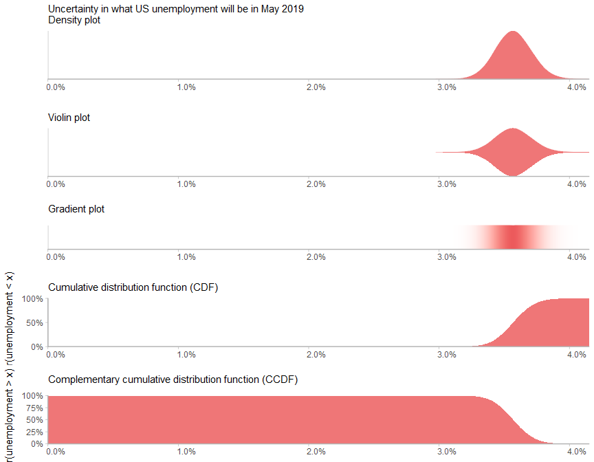<!-- -->

## Quantile dotplot

``` r
predict_plot = predictions %>%
  filter(date %in% c(ymd("2019-05-01"), ymd("2019-11-01"), ymd("2020-05-01"))) %>%
  group_by(date) %>%
  do(tibble(.prediction = quantile(.$.prediction, ppoints(50)))) %>%
  ggplot(aes(x = .prediction)) +
  geom_hline(yintercept = 0, color = "gray85", linetype = "dashed") +
  geom_dotplot(fill = prediction_color_fill, color = NA, binwidth = .001, dotsize = 1.1) +
  ylab(NULL) +
  xlab(NULL) +
  scale_y_continuous(breaks = NULL) +
  scale_x_continuous(breaks = NULL) +
  coord_flip(xlim = c(0, y_max), expand = FALSE) +
  facet_grid(. ~ date, labeller = labeller(date = function(x) strftime(x, "%b\n%Y")), switch = "x", scales = "free_x") +
  facet_x_labels

plot_grid(align = "h", axis = "tb", ncol = 2, rel_widths = c(4, 1),
    fit_plot,
    predict_plot
  ) +
  draw_grob(grid::rectGrob(gp = grid::gpar(fill = "white", col = NA)), x = .8, y = .75, width = .2, height = .2) +
  draw_label(x = 0.8, y = .9, hjust = 0, vjust = 1, size = 11, lineheight = 1.1,
    label = "50 equally likely predictions\nfor what unemployment\nin May 2019") +
  draw_label(x = 0.8, y = .9, hjust = 0, vjust = 1, size = 11, lineheight = 1.1,
    label = "\n\n                    will be", colour = prediction_color, fontface = "bold") +
  draw_line(x = c(0.82, 0.82), y = c(.76, .48), size = 1, colour = prediction_color, linejoin = "mitre", arrow = arrow_spec)
```

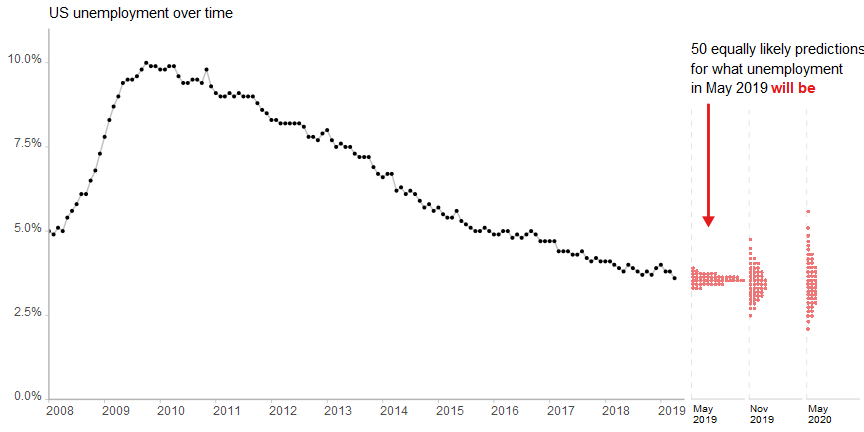<!-- -->

## HOPs

``` r
n_hops = 100
n_frames = n_hops
set.seed(123456)

anim = df %>%
  filter(year(date) >= since_year) %>%
  ggplot(aes(x = date, y = unemployment)) +
  geom_line(aes(y = .prediction, group = .draw), color = prediction_color, size = .75, 
    data = predictions_with_last_obs %>% sample_draws(n_hops)) +
  geom_line(color = "gray75") +
  geom_point(size = 0.75) +
  prediction_annotation +
  y_axis +
  x_axis +
  title +
  transition_manual(.draw) 

animate(anim, nframes = n_frames, fps = n_frames / n_hops * 2.5, res = 100, width = 900, height = 450, type = "cairo")
```

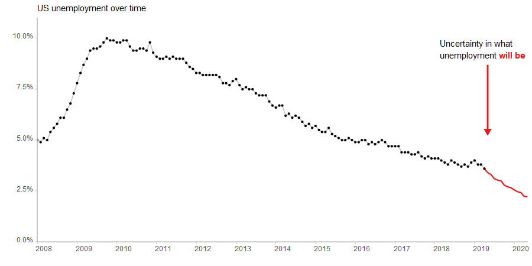<!-- -->

Or HOPs with static ensemble in the background:

``` r
predictions_with_last_obs_draws = predictions_with_last_obs %>% 
  sample_draws(n_hops)

anim = df %>%
  filter(year(date) >= since_year) %>%
  ggplot(aes(x = date, y = unemployment)) +
  geom_line(aes(y = .prediction, group = .group), color = "black", alpha = 1/50, size = .75,
    data = rename(predictions_with_last_obs_draws, .group = .draw)) +
  geom_line(aes(y = .prediction, group = .draw), color = prediction_color, size = .75, 
    data = predictions_with_last_obs_draws) +
  geom_line(color = "gray75") +
  geom_point(size = 0.75) +
  prediction_annotation +
  y_axis +
  x_axis +
  title +
  transition_manual(.draw) 

animate(anim, nframes = n_frames, fps = n_frames / n_hops * 2.5, res = 100, width = 900, height = 450, type = "cairo")
```

<!-- -->
